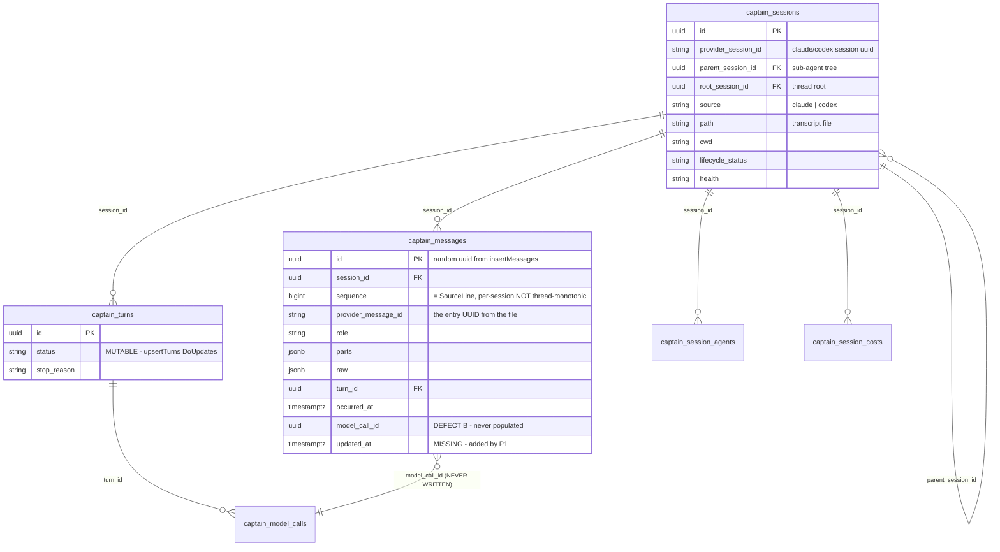
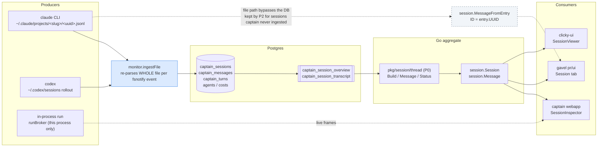

# Session data model

How a session travels from an agent process to the gavel Session tab, across captain's storage and projection layers.

Written while planning the session unification (todos P0 `6a897b78`, P1 `ff383651`, P2 `8f1fb6e9`, P3 `03394394`, P5 `b20f56f5`). Two defects marked below are not yet covered by any of them.

## Entities

`captain_messages` is append-only (`insertMessages` uses `OnConflict{DoNothing}`), while `captain_turns` is upserted in place. That asymmetry is why turn enrichment has to travel on its own frame rather than resending messages — and why P1 adds `updated_at` before anything trusts a cursor.

## Paths

The solid path is what P0–P2 unify. The dashed path is the raw JSONL tail that P2 deliberately keeps in gavel (`streamSessionLog`) for sessions captain never ingested — so both branches stay live, which is exactly why message identity has to agree across them.

## Defect A — message identity splits by path

The same logical message carries two different IDs depending on which path served it:

| Path | `Message.ID` source | Where |
|---|---|---|
| File | `entry.UUID` | `pkg/session/build_messages.go:116` |
| Ingest | stores that same UUID as `provider_message_id` | `pkg/monitor/ingest.go:232` |
| DB (gavel today) | `row.id` — the random `uuid.New()` from `insertMessages` | `pr/ui/todo_session.go:~525` |

P0 introduces `thread.Message(row, owner)` to replace `captainTranscriptMessage` but does not specify which ID it emits. If it copies today's behavior, **P2's `id:` = cursor SSE resume is built on an identity that changes when the backend changes**, so client dedupe breaks precisely on reconnect.

Fix: `Message.ID` should come from `provider_message_id`, falling back to the row UUID only when NULL — and the fallback reported rather than silent.

## Defect B — three permanently-null columns

`messageRecord` (`pkg/database/session_ingest_store.go:96-108`) has no `ModelCallID` field, and `model_call_id` has zero writes anywhere in `pkg/`. But `migrations/61_view_session_transcript.sql:27` joins `captain_model_calls ON c.id = m.model_call_id`, so `model`, `backend` and `effort` are permanently NULL on the transcript projection.

P0's collection endpoint would ship three fields that can never be populated, and P5's drift tests would then lock them in. Either wire `ModelCallID` at ingest or drop them from the projection.

## Ordering and cursors

`captain_session_transcript` orders by `occurred_at NULLS LAST, session_id, sequence`. Two consequences:

- `sequence` is per-session `SourceLine` (`pkg/monitor/ingest.go:180`), **not** thread-monotonic, so it cannot serve as a cursor alone. P1's cursor is `base64("<occurred_at RFC3339Nano>|<session_id>|<sequence>")`.
- `occurred_at` may be NULL, and a late-arriving sub-agent message can interleave *before* rows already delivered — which is why exactly-once resume needs the full tuple rather than a single high-water mark.

## Role coverage

The two read paths do not agree on which roles they return:

- **DB projection** — role-complete (user, assistant, tool_result).
- **File tail** — assistant-only. `history.SessionEntry.Events()` (`pkg/ai/history/session_stream.go:54-57`) hard-returns nil for `Type != "assistant"`, with no opt-out.

That filter is correct for its one caller — cmux's `sessionTailer` uses it as a turn-completion detector, where user rows are noise. The fix is for the unified read path to use `session.MessageFromEntry` instead of `ParseSessionEvents`, so file-tail and file-batch produce identical messages by construction. Until then, one endpoint returns different content depending on which backend answered.
